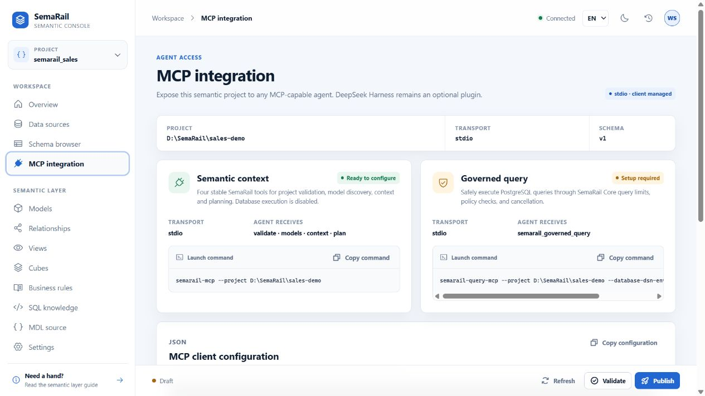

# SemaRail

> A governed semantic layer that helps AI agents understand business data and run safe, inspectable queries.

[](LICENSE)


SemaRail turns database schemas, business definitions, relationships, rules, and reviewed SQL into a semantic context that AI agents can use consistently. It provides a visual Semantic Console for managing that context, a stable MCP interface for agent integration, and a governed query boundary for read-only data access.

SemaRail is agent-neutral. Any MCP-capable client can use its semantic tools. It also provides a dedicated, independently installable DeepSeek Harness plugin that connects Harness to SemaRail Core, turning it into a governed Data Agent with native Chart, Table, and SQL views.

> **Status:** Alpha. APIs, configuration, and storage formats may change before the first stable release. Core and Harness plugin tarballs can be built from source; npm and PyPI packages are not published yet.


## Features

- **Visual semantic modeling** — import database schemas and manage models, fields, relationships, views, cubes, business rules, and reviewed SQL knowledge.
- **Agent-neutral MCP tools** — expose semantic context and governed queries through authenticated Streamable HTTP, with an authenticated stdio bridge for clients that require it.
- **Governed data access** — resolve every request to a current Subject and policy, parse generated PostgreSQL with `sqlglot`, enforce table/column/row rules and physical-object allowlists, and apply read-only, timeout, row, byte, and concurrency limits.
- **Enterprise identity and policy** — use revocable service-account keys or DingTalk/OIDC employee sessions, change permissions without reinstalling Agents, and audit decisions without storing SQL, result rows, or secrets.
- **Common database metadata** — test connections, browse schemas, and import models from PostgreSQL, MySQL, SQLite, ClickHouse, and DuckDB.
- **Versioned semantic projects** — validate drafts, inspect generated source and diffs, publish revisions, and roll back changes.
- **Bilingual metadata** — maintain English and Simplified Chinese display names without changing stable technical identifiers.
- **DeepSeek Harness Data Agent** — install the optional thin Host/Client plugin to give Harness SemaRail semantic context, governed querying, cancellation, and durable Chart, Table, and SQL results.

### Datasource management

Datasource credentials stay on the server and are redacted from API responses. The standard Console installation includes PostgreSQL, MySQL, SQLite, ClickHouse, and DuckDB drivers for connection testing, schema browsing, and model import. Local SQLite and DuckDB files are opened read-only.


### Semantic model workbench

Edit business names, descriptions, visibility, primary keys, and field dictionaries while keeping generated semantic source and a unified diff nearby.


### Relationship graph

Explore and maintain field-level model relationships in an interactive graph.


## Project roadmap

This roadmap highlights major project milestones. For file-level release notes,
see [CHANGELOG.md](CHANGELOG.md).

| Date | Status | Milestone |
| --- | --- | --- |
| 2026-08-30 | Completed | Established the SemaRail brand, Semantic Console, stable semantic MCP contract, and separate Core/DeepSeek Harness plugin packages. |
| 2026-08-31 | Completed | Added DingTalk and OIDC employee sign-in, revocable sessions, trusted subject attributes, and administrator-managed account access. |
| 2026-09-01 | Completed | Added project-, datasource-, table-, column-, and row-scoped authorization with immediate policy and credential revocation. |
| 2026-09-02 | Completed | Added multi-user authenticated MCP, PostgreSQL-backed access-control storage, transaction-local subject context, and PostgreSQL RLS isolation. |
| 2026-09-03 | Completed | Hardened permission-control acceptance with real PostgreSQL 17 tests, first-request MCP query startup, clean Linux CI builds, and A/B employee row-isolation verification. |
| Next | Planned | Extend governed query execution beyond PostgreSQL while preserving the same policy, limits, audit, and cancellation contract. |
| Next | Planned | Add a managed CSV/Excel ingestion workflow backed by DuckDB, without exposing uploaded files or local paths to Agents. |
| Later | Planned | Publish versioned SemaRail Core and DeepSeek Harness plugin packages after the alpha installation and upgrade flow is stable. |

## Tech stack

- Python 3.11+
- TypeScript and Node.js
- React 18 and Vite
- Model Context Protocol (MCP) Python SDK
- `sqlglot` for structural SQL validation
- PostgreSQL for governed query execution
- PostgreSQL, MySQL, SQLite, ClickHouse, and DuckDB drivers for Console metadata workflows
- Apache ECharts for conversation-native charts

## Quick start

### Install SemaRail Core

Requirements:

- Node.js `^22.19.0 || >=24`
- Python `>=3.11`

Until the split packages are published, build both local tarballs from the repository:

```powershell
pnpm install
pnpm package:split
npm install --global .\dist\hejielijob-semarail-core-0.1.0-alpha.3.tgz
$env:SEMARAIL_API_TOKEN = semarail token create
semarail start --project C:\path\to\semantic-project
```

The Core process owns the semantic project, database credentials, execution limits, Semantic Console, and MCP servers. Open [http://127.0.0.1:48763](http://127.0.0.1:48763) after it starts. Keep `SEMARAIL_API_TOKEN` private: it is the local bootstrap-administrator credential used to create narrower, revocable service-account keys.

### Optional DeepSeek Harness plugin

In Access Control, create a dedicated Harness service account, bind only the required project/table/row policy, and issue a one-time `sr_live_...` key. Provide that scoped key—not the bootstrap token—to Harness:

```powershell
$env:SEMARAIL_HARNESS_TOKEN = "<scoped sr_live_... key>"
dsh plugin --profile web add .\dist\hejielijob-dsh-semarail-plugin-0.1.0-alpha.3.tgz
```

The plugin connects to `http://127.0.0.1:48763` by default. It no longer embeds or starts Python, the Semantic Console, or the semantic runtime.

### Run from source

Requirements:

- Git
- Node.js `^22.19.0 || >=24`
- pnpm `11.x`
- Python `>=3.11`
- PostgreSQL only if you want to execute governed queries

```powershell
git clone https://github.com/hejielijob-commits/SemaRail.git
cd SemaRail
pnpm install
pnpm build
```

Create the Python environment and install the semantic runtime, MCP servers, Console, governed PostgreSQL query driver, and Console metadata drivers:

```powershell
py -3.11 -m venv .venv
& .\.venv\Scripts\python.exe -m pip install `
  -e ".\python\sidecar[wren,mcp]" `
  -e ".\apps\semantic-console[wren]"
```

### Start the Semantic Console

The repository includes a deterministic sales project for a local tour:

```powershell
$stateDir = Join-Path $env:LOCALAPPDATA "semarail\semantic-console\sales-demo"
& .\.venv\Scripts\python.exe -m server `
  --project-dir .\examples\wren-postgres `
  --state-dir $stateDir `
  --static-dir .\apps\semantic-console\web\dist
```

Open [http://127.0.0.1:48763](http://127.0.0.1:48763). The server binds to loopback by default.

## Use SemaRail with MCP agents

The default multi-user integration is SemaRail's authenticated Streamable HTTP
MCP endpoint. It exposes the same five stable tools to any MCP-capable Agent:

- `semarail_validate_project`
- `semarail_list_models`
- `semarail_get_context`
- `semarail_plan_query`
- `semarail_governed_query`



### Start authenticated MCP

Start the MCP endpoint against the same project and state directory as Core:

```powershell
$env:SEMARAIL_API_TOKEN = "<local bootstrap token>"
semarail mcp serve `
  --project C:\path\to\semantic-project `
  --state-dir C:\path\to\semarail-state
```

The endpoint is `http://127.0.0.1:48764/mcp`. The bootstrap token initializes
the shared control-plane store but is rejected by remote MCP. In **Access
control**, create a service account, assign trusted attributes, bind a
project/datasource/table/column/row policy, and issue a one-time key. Configure
that managed key in the Agent's private environment or secret manager:

```json
{
  "mcpServers": {
    "semarail": {
      "url": "http://127.0.0.1:48764/mcp",
      "transport": "streamable-http",
      "headers": {
        "Authorization": "Bearer ${SEMARAIL_TOKEN}"
      }
    }
  }
}
```

Every call re-authenticates the key or employee session and reads current policy,
so disabling an account, revoking a key, changing attributes, or unbinding a
policy affects the next request. Datasource credentials and project paths remain
inside Core and never enter MCP client configuration. Loopback is the safe
default; a non-loopback bind requires an explicit `--allowed-host` and a TLS
reverse proxy.

### Service accounts, employees, and row permissions (alpha)

SemaRail Core includes a local management API for service accounts and externally authenticated employees, one-time API-key issuance, key rotation/revocation, short-lived employee sessions, versioned policy bindings, and audit events. Policies can restrict tool scopes, projects, physical tables, columns, query limits, and rows derived from trusted subject attributes. Mandatory row predicates are injected with bound database parameters before execution; missing or malformed permissions fail closed.

For example, two agents can run the same sales query while account A is restricted to region `CN-JIA` and account B to `CN-YI`. Updating the account attributes or policy is effective on the next request. See [Access control (alpha)](docs/access-control.md) and [the architecture decision](docs/decisions/0005-enterprise-identity-and-data-authorization.md).

Employees can sign in through a configured DingTalk or generic OIDC provider with `semarail auth login --provider <id>`. The browser callback never receives a SemaRail bearer token; the initiating CLI exchanges a one-time device code for a bounded session and then enters the same Subject/PolicyEngine path as an API key. New employees have no data policy until an administrator assigns trusted attributes and a policy in **Access control**. See [Access control (alpha)](docs/access-control.md) for provider configuration and security boundaries.

### Authenticated stdio bridge

For an Agent that only supports stdio, log in once and configure the bridge as
its MCP command:

```powershell
semarail auth login --provider dingtalk --endpoint http://127.0.0.1:48763
semarail mcp bridge --endpoint http://127.0.0.1:48763
```

The bridge reads the ACL-protected employee session written by `semarail auth
login` and forwards every tool to Core's authenticated runtime. It does not load
Wren, open a database, accept a Subject/policy/DSN argument, or print the token.
For a service account instead, set `SEMARAIL_MCP_TOKEN` in the bridge process's
private environment. Use `--token-env <NAME>` to select another environment
variable name.

### Trusted local operator compatibility

`semarail-mcp` and `semarail-query-mcp` remain available for compatibility and
isolated local evaluation. They directly load the project/Sidecar and therefore
do **not** provide per-user Subject resolution, immediate policy changes, or
identity audit. Do not use them as a shared employee or multi-tenant boundary.
Use authenticated HTTP MCP or `semarail mcp bridge` instead.

Run MCP acceptance tests with:

```powershell
pnpm acceptance:mcp
pnpm acceptance:split
```

## DeepSeek Harness plugin

SemaRail includes an optional thin DeepSeek Harness plugin for users who want the semantic layer in the Harness conversation UI. The plugin connects to an independently running SemaRail Core; the Semantic Console and MCP servers do not require DeepSeek Harness.

The plugin provides:

- A Host plugin that connects to SemaRail Core for semantic context, governed PostgreSQL execution, and cancellation.
- A Client plugin that renders durable Chart, Table, and SQL views from `tool/result.meta`.
- A shortcut from Harness to the local Semantic Console.
- Compatibility with DeepSeek Harness `>=0.1.0-rc.10 <0.2.0`.

### Install the Harness plugin from source

The recommended integration is the thin `@hejielijob/dsh-semarail-plugin` package. It depends on a separately running SemaRail Core through the authenticated, versioned HTTP v1 boundary. Build both unpublished packages locally:

```powershell
pnpm install
pnpm package:split
```

Install the generated package with the same one-command Harness flow used by registry plugins:

```powershell
dsh plugin --profile web add .\dist\hejielijob-dsh-semarail-plugin-0.1.0-alpha.3.tgz
```

You can also download the `.tgz` from a future GitHub Release and pass its local path or HTTPS URL to the same command. Once the package is published to npm, installation will reduce to:

```powershell
dsh plugin --profile web add @hejielijob/dsh-semarail-plugin
```

The former `@hejielijob/dsh-wren-data-agent` all-in-one package remains as a legacy compatibility artifact for now. Do not enable both packages in the same Harness profile. See [the migration guide](docs/deepseek-harness-plugin.md).

Verify both package boundaries with:

```powershell
pnpm --filter @hejielijob/semarail-core test
pnpm --filter @hejielijob/dsh-semarail-plugin test
```

### Configure the Harness Host

The plugin accepts only connection settings; project paths, credentials, and execution limits stay in Core:

```yaml
- id: semarail-harness-host
  config:
    semarailEndpoint: http://127.0.0.1:48763
    authTokenEnv: SEMARAIL_HARNESS_TOKEN
    timeoutMs: 30000
```

Set `SEMARAIL_DATABASE_URL` only in the Core process environment when governed PostgreSQL execution is required. The Harness plugin never receives the DSN. Never expose the Core bootstrap `SEMARAIL_API_TOKEN` to Harness or another Agent: it is limited to Console administration, recovery, and the read-only Core health check; semantic/query runtime methods and MCP boundaries reject it. Use a managed `sr_live_...` key or employee session instead.

The Client opens the Semantic Console at `http://127.0.0.1:48763` by default. An embedding can pass `semanticConsoleUrl` to the exported view/link props or set `localStorage['semarail.semantic-console-url']`; only credential-free absolute HTTP(S) URLs are accepted. The former `dsh-wren-data-agent.semantic-console-url` key is read only as a migration fallback.

## Security model

All model-generated SQL is treated as untrusted input.

- PostgreSQL statements are parsed structurally with `sqlglot`.
- DML, multi-statement SQL, dangerous functions, and unauthorized objects fail closed.
- Query execution uses a read-only account with row, byte, timeout, concurrency, and cancellation limits.
- PostgreSQL deployments can add transaction-local Subject context and native RLS as a second enforcement layer; see [PostgreSQL row-level security](docs/postgresql-rls.md).
- Protocol and presentation payloads are JSON-safe and versioned; unknown versions fail closed.
- Sidecar stdout is protocol-only; diagnostics go to stderr.
- Datasource credentials remain server-side and are redacted from Console API responses.
- The Console remains loopback-only in this alpha release. Subject policies, table/column/row authorization, PostgreSQL RLS context, optional PostgreSQL control-plane storage, and metadata-only audit events are implemented. Internet exposure still requires a hardened reverse proxy, TLS, deployment monitoring, backup/restore, and an organization-specific identity configuration.

## Repository layout

| Path | Purpose |
| --- | --- |
| `apps/semantic-console` | Local Python server and React Semantic Console. |
| `python/sidecar` | Semantic planning, SQL policy/execution, framed RPC, and MCP servers. |
| `packages/contract` | Shared Host, Client, and Sidecar contracts. |
| `packages/host` | Shared Harness Host adapters, tool registration, and legacy bundle support. |
| `packages/client` | DeepSeek Harness Chart, Table, SQL, and Console views. |
| `packages/core` | Independently installable SemaRail Core CLI/runtime distribution. |
| `packages/dsh-plugin` | Thin DeepSeek Harness Host/Client adapter. |
| `packages/bundle` | Legacy all-in-one DeepSeek Harness compatibility bundle. |
| `examples/wren-postgres` | Deterministic sales project and golden-question corpus. |
| `scripts` | Packaging, acceptance, replay, and evaluation gates. |

## Development

```powershell
pnpm typecheck
pnpm test
pnpm build
pnpm acceptance:split
pnpm acceptance:mcp
```

Additional integration gates:

```powershell
pnpm acceptance
# Run the real PostgreSQL 17/RLS gate. It requires administrator settings and
# creates, then cleans, isolated test database/role fixtures.
pnpm acceptance:postgres
# Preview the PostgreSQL acceptance prerequisites without changing the database.
& .\.venv\Scripts\python.exe scripts\acceptance-postgres.py --dry-run
pnpm acceptance:replay --dry-run
pnpm evaluate:golden --self-test
```

See [CONTRIBUTING.md](CONTRIBUTING.md) before opening a pull request. Report security issues through the private process in [SECURITY.md](SECURITY.md), not through a public issue. User-visible changes are tracked in [CHANGELOG.md](CHANGELOG.md).

## Current scope

- SemaRail's semantic MCP interface can use datasources supported by the configured semantic profile.
- Governed query execution through MCP or DeepSeek Harness is currently PostgreSQL-only.
- The Semantic Console supports PostgreSQL, MySQL, SQLite, ClickHouse, and DuckDB connection testing, schema browsing, and model import.
- The current semantic runtime does not support View-to-View references; nested View dependencies are rejected before execution.
- Browser hard-refresh rendering remains a separate real-Client acceptance step beyond the API-only replay gate.

## Upstream foundation

SemaRail is based on and adapted from the [WrenAI](https://github.com/Canner/WrenAI) codebase and Python SDK/Core. It currently uses `wrenai==0.13.2` and its public context, validation, build, field-registry, and project-format APIs.

SemaRail is an independent project, not an official WrenAI distribution or Canner product, and is not endorsed by or affiliated with Canner. The SemaRail name and branding are independent of the upstream project.

## License

This repository is released under the [MIT License](LICENSE), copyright © 2026 `hejielijob-commits`.

Third-party components retain their own licenses:

- `wrenai==0.13.2` identifies itself as Apache-2.0 and is maintained by the [WrenAI project](https://github.com/Canner/WrenAI).
- The Client bundles Apache ECharts `5.6.0`; its Apache-2.0 `LICENSE` and `NOTICE` are shipped in `packages/client/licenses/echarts`.

See [THIRD_PARTY_NOTICES.md](THIRD_PARTY_NOTICES.md) for the dependency and artifact attribution inventory.
