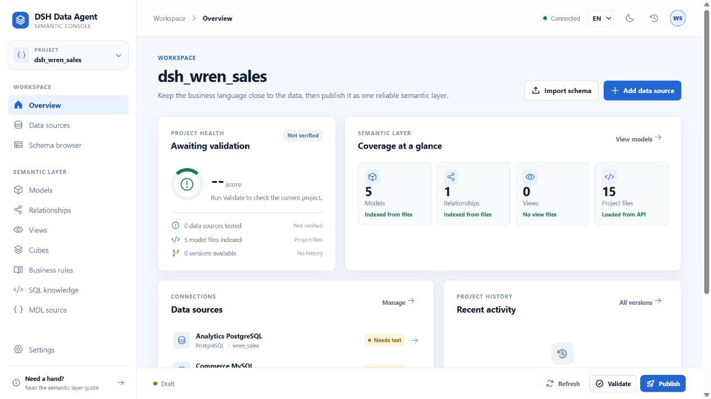
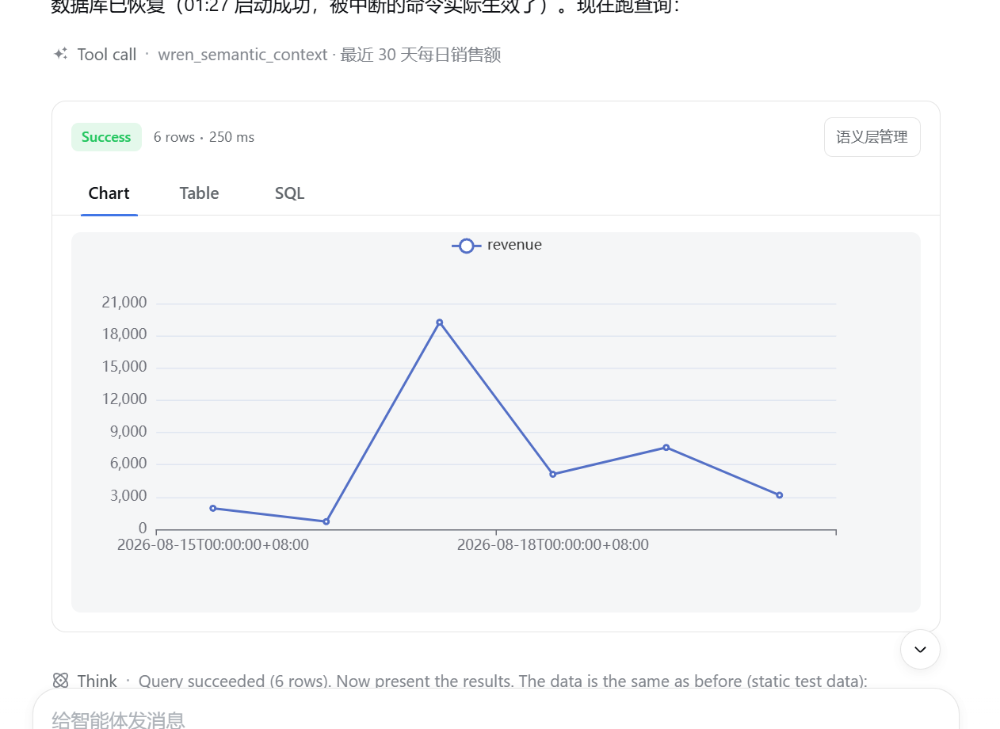
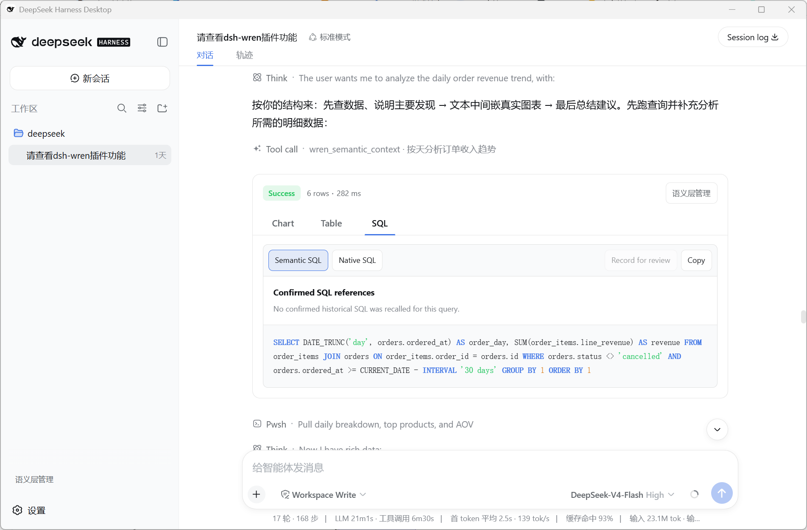
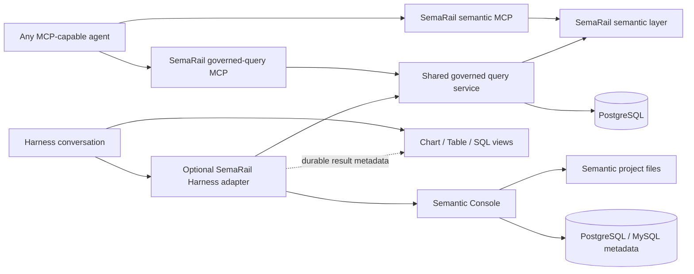
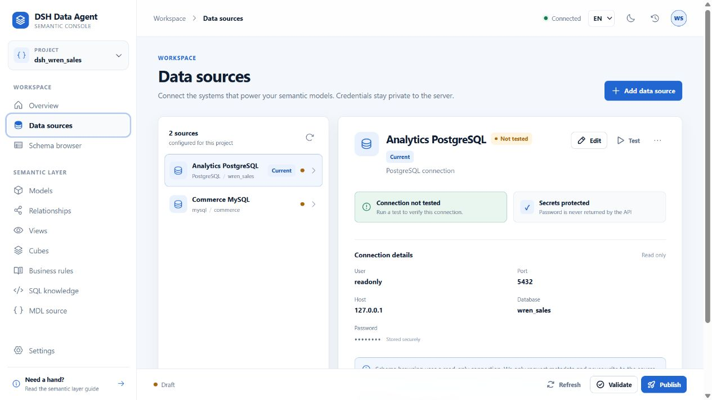
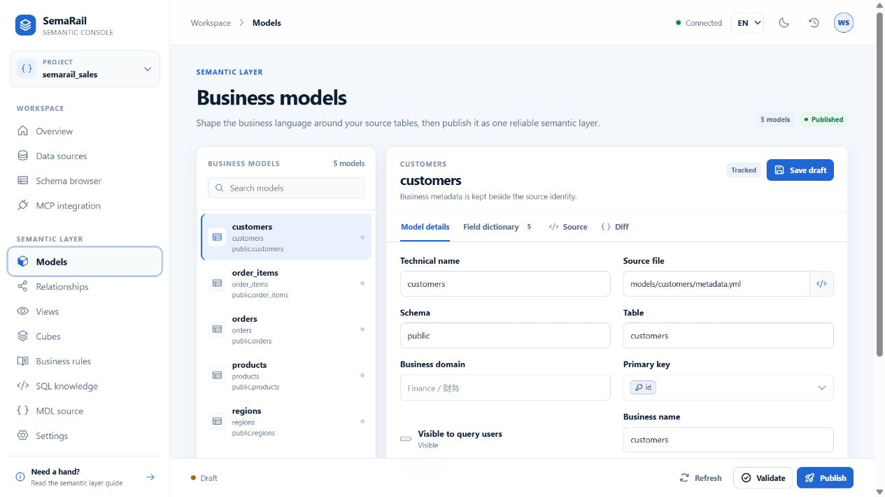
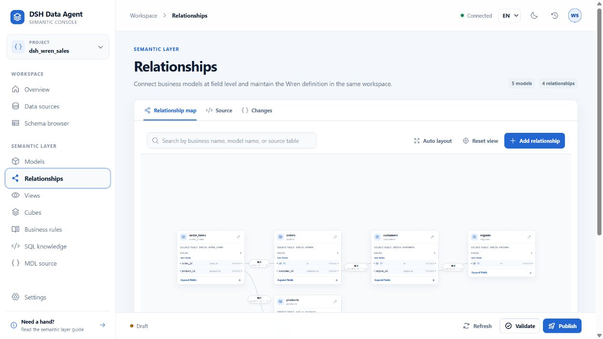

# SemaRail

> Governed semantic data infrastructure for MCP-capable agents.

[](LICENSE)


SemaRail is an agent-facing semantic data layer for MCP-capable agents. It turns governed business semantics into reliable, inspectable answers through context-aware planning, validation, bounded read-only queries, and conversation-native Chart, Table, and SQL results. A local Semantic Console manages semantic projects, metadata, knowledge, and publication workflows.

Connect SemaRail to any MCP-capable agent through its portable semantic tool surface. Optional conversation adapters provide the same durable result views and governed query boundary in supported hosts, while datasource credentials remain server-side and every result stays versioned and JSON-safe.

> **Project status:** Alpha. The repository is open for evaluation and contribution, but its APIs, configuration, and storage formats may change before the first stable release. The current code is built and installed from source; npm and PyPI publication are intentionally out of scope.

## Attribution / Upstream foundation

SemaRail is based on and adapted from the [WrenAI](https://github.com/Canner/WrenAI) codebase and Python SDK/Core. It currently uses `wrenai==0.13.2` and its public context, validation, build, field-registry, and project-format APIs. WrenAI is developed by [Canner](https://www.canner.io/), and the pinned upstream distribution identifies itself as Apache-2.0 licensed.

SemaRail's own repository code is released under the [MIT License](LICENSE). SemaRail is an independent project, not an official WrenAI distribution or Canner product, and it is not endorsed by or affiliated with Canner. The SemaRail name and branding are independent of the upstream project.



## What you get

| Capability | What it provides |
| --- | --- |
| Agent-neutral MCP | Portable semantic-context and governed-query MCP servers for any MCP-capable agent. |
| Semantic-aware agent tools | Retrieves SemaRail context before SQL generation and returns versioned, JSON-safe query results. |
| Governed query execution | PostgreSQL AST validation, object allowlists, read-only execution, row/byte/time limits, and cancellation. |
| Conversation-native results | Reconstructable Chart, Table, and SQL views rendered from durable `tool/result.meta`. |
| Semantic Console | A responsive local UI for data sources, schema import, models, relationships, views, cubes, rules, SQL knowledge, MCP integration, drafts, validation, publishing, and rollback. |
| Bilingual editing | English and Simplified Chinese display metadata without changing stable technical identifiers. |
| Verifiable delivery | Unit, package, isolated Harness, real PostgreSQL, replay, and golden-question acceptance gates. |

## Optional DeepSeek Harness experience

The SemaRail adapter renders query results directly in the conversation. The chart view below shows a successful six-row daily-revenue query using the durable result metadata returned by the tool.



The SQL view keeps the generated Semantic SQL inspectable, lets users switch to Native SQL, and reports whether confirmed historical SQL was recalled for the answer.



## How it works



SemaRail's semantic MCP supplies the portable semantic tools. Its query MCP and
the optional Harness Host share the same governed query service:

- The query service validates semantic context and untrusted SQL, executes bounded PostgreSQL queries, and produces table/chart presentation contracts.
- The Semantic Console serves a local REST API and production SPA for managing semantic projects and datasource profiles.

Datasource credentials stay server-side. They never enter Client payloads, tool output, session metadata, fixtures, or default logs.

## Semantic Console

### PostgreSQL and MySQL data sources

The Console exposes only datasource types that are implemented and available in the running Python environment. The standard install includes PostgreSQL and MySQL drivers for connection testing, schema browsing, and model import.



### Business model workbench

Edit business names, descriptions, visibility, primary keys, and field dictionaries while keeping the generated semantic source and unified diff close at hand.



### Relationship graph

Explore and maintain field-level model relationships in an interactive graph, with source and change views in the same workbench.



The Console also includes:

- Schema, table, and column browsing with explicit model import.
- Revision-protected View and Cube workbenches.
- Business-rule and reviewed SQL-knowledge governance.
- Draft validation, publication, version history, and rollback.
- Source-aware editors for MDL, localized metadata, and generated diffs.

## Quick start from source

### Prerequisites

- Node.js `^22.19.0 || >=24`
- pnpm `11.x`
- Python `>=3.11`
- SemaRail's pinned Python semantic runtime dependencies
- PostgreSQL for the agent query path
- DeepSeek Harness `>=0.1.0-rc.10 <0.2.0` only when using the Harness adapter

### Build the workspace

```powershell
pnpm install
pnpm build
```

### Prepare the Python runtime

The following creates a development environment with SemaRail's semantic MCP server,
the governed PostgreSQL query runtime, and both Console metadata drivers:

```powershell
py -3.11 -m venv .venv
& .\.venv\Scripts\python.exe -m pip install -e ".\python\sidecar[wren,mcp]" -e ".\apps\semantic-console[wren]"
```

### Run the Semantic Console

Use the included deterministic sales project for a local tour:

```powershell
$stateDir = Join-Path $env:LOCALAPPDATA "semarail\semantic-console\sales-demo"
& .\.venv\Scripts\python.exe -m server `
  --project-dir .\examples\wren-postgres `
  --state-dir $stateDir `
  --static-dir .\apps\semantic-console\web\dist
```

Open [http://127.0.0.1:48763](http://127.0.0.1:48763). The server binds to loopback by default.

## Use with any MCP-capable agent

Build the semantic project, then register two SemaRail stdio MCP servers. The
semantic server exposes SemaRail's stable, database-disconnected tool contract:

- `semarail_validate_project`
- `semarail_list_models`
- `semarail_get_context`
- `semarail_plan_query`

These tools use the pinned WrenAI runtime and its project structures directly;
SemaRail does not convert the project into a second semantic model.

```powershell
semarail-mcp --project C:\path\to\semantic-project
```

Start the SemaRail execution server against the same project. Provide the read-only
PostgreSQL DSN through the named operating-system environment variable or a
secret manager; never put the DSN in an Agent prompt or MCP tool arguments.

```powershell
# SEMARAIL_DATABASE_URL is inherited from the OS or your secret manager.
semarail-query-mcp `
  --project C:\path\to\semantic-project `
  --database-dsn-env SEMARAIL_DATABASE_URL
```

The MCP client discovers the four semantic tools from the first server and the
single `semarail_governed_query` execution tool from the second. The latter uses the
same MDL-derived physical allowlist, dangerous-function policy, read-only
transaction, 30-second ceiling, row/byte bounds, two-query concurrency cap,
stable errors, and database cancellation path as the Harness adapter. Project
and credential-source selection are fixed at server startup and are not exposed
to the Agent. DeepSeek Harness is not required.

Governed deployments should keep semantic discovery separate from database
execution and route execution only through `semarail_governed_query`.

For a credential-free proof that builds a real Wren project and exercises an
official MCP client against both SemaRail servers and the policy boundary:

```powershell
pnpm acceptance:mcp
```

SemaRail's stable semantic endpoint currently supports stdio. Keep the optional
upstream-native MCP endpoint separate if you use it for experimentation; its
larger tool surface is not part of SemaRail's compatibility contract.

## Harness configuration

The workspace builds the bundle package as `@hejielijob/dsh-wren-data-agent`. It is not currently published to npm. Its Host package stages the query sidecar, Semantic Console server, and production SPA into the local package artifact, so the artifact can be installed into Harness after it is built from source.

Configure the Host with an absolute semantic project directory and the Python interpreter that contains the packaged runtime dependencies. The package and Host IDs below are retained as compatibility identifiers for existing installs:

```yaml
- id: wren-data-agent-host
  config:
    pythonExecutable: C:\Python311\python.exe
    projectDir: D:\data\semantic-project
    databaseDsnEnv: SEMARAIL_DATABASE_URL
    # semanticConsoleEnabled: false
    # workingDirectory: D:\managed\sidecar
```

Provide the read-only PostgreSQL DSN through the operating system or a secret manager, using the environment-variable name configured by `databaseDsnEnv`. Never put the DSN itself in Bundle configuration.

For a packaged Host install, install the Python runtimes into the Host's selected environment:

```powershell
$sidecarDir = "C:\path\to\node_modules\@hejielijob\dsh-wren-data-agent-host\python\sidecar"
$consoleDir = "C:\path\to\node_modules\@hejielijob\dsh-wren-data-agent-host\python\semantic-console"
$python = "C:\Python311\python.exe"

Push-Location $sidecarDir
& $python -m pip install ".[wren]"
Pop-Location
& $python -m pip install $consoleDir
```

The public Harness Client context does not currently expose a stable Host-to-Client Console URL. The Client therefore uses `http://127.0.0.1:48763` by default. An embedding can pass `semanticConsoleUrl` to the exported view/link props or set `localStorage['dsh-wren-data-agent.semantic-console-url']`; only credential-free absolute HTTP(S) URLs are accepted.

## Security model

All model-generated SQL is treated as untrusted input.

- PostgreSQL statements are parsed structurally with `sqlglot`; lexical checks are not used as the security boundary.
- DML, multi-statement SQL, dangerous functions, and unauthorized objects fail closed.
- Query execution uses a read-only account and enforces server-side row, byte, timeout, and cancellation limits.
- Protocol and presentation payloads are JSON-safe and versioned; unknown versions fail closed.
- Sidecar stdout is protocol-only, while diagnostics go to stderr.
- Console credentials are stored outside the semantic project in the runtime state directory and are redacted from API responses.
- The Console is loopback-only and unauthenticated in this MVP. Team authentication, RBAC, approvals, and audit logging remain deployment work.

These stricter controls are shared by the Harness sidecar and
`semarail-query-mcp`. Keep semantic discovery disconnected from the database
when the SemaRail execution policy must be mandatory. The query MCP adapter is
stdio-only, so it does not create an
unauthenticated network listener.

## Repository layout

| Path | Ownership |
| --- | --- |
| `packages/contract` | Shared Host, Client, and Sidecar contracts. |
| `packages/host` | Harness tools, process supervision, cancellation, and durable result projection. |
| `packages/client` | Conversation Chart/Table/SQL views and Semantic Console entry points. |
| `packages/bundle` | Installable `dsh.bundle` composition. |
| `python/sidecar` | Shared semantic planning, PostgreSQL policy/execution, limits, framed RPC, and governed MCP adapter. |
| `apps/semantic-console` | Local REST server and React management console. |
| `examples/wren-postgres` | Deterministic sales project, seed data, and golden-question corpus. |
| `scripts` | Packaging, acceptance, replay, and evaluation gates. |

## Development and verification

Contributions are welcome. Read [CONTRIBUTING.md](CONTRIBUTING.md) for setup, test, and pull-request expectations. Please report security issues through the private process in [SECURITY.md](SECURITY.md), not through a public issue. User-visible changes are tracked in [CHANGELOG.md](CHANGELOG.md).

Run the standard workspace checks:

```powershell
pnpm typecheck
pnpm test
pnpm build
```

Run the agent-neutral MCP gates:

```powershell
pnpm acceptance:mcp
```

It creates a temporary DuckDB database, isolated runtime home and semantic project,
then drives both real stdio server adapters through the official Python MCP
client. It verifies native tool discovery and the context/plan/query workflow,
plus the SemaRail tool surface, fixed operator policy, result bounds, and policy
denial without reading local profiles or credentials.

Run the isolated Harness packaging gate:

```powershell
pnpm acceptance
```

It packs the Contract, Host, Client, and Bundle into a fresh temporary Harness profile, verifies the composed configuration, starts the installed runtime, and checks both the Harness web application and plugin assets. It does not modify the Harness checkout.

Run the real PostgreSQL boundary gate after configuring an existing administrator connection:

```powershell
& .\.venv\Scripts\python.exe scripts\acceptance-postgres.py --dry-run
& .\.venv\Scripts\python.exe scripts\acceptance-postgres.py
```

The default provision mode creates and later removes only a uniquely named
temporary database and read-only role. It exercises both the framed Harness
sidecar and the real stdio `semarail_governed_query` MCP path. For a managed database
that must not be changed, use:

```powershell
& .\.venv\Scripts\python.exe scripts\acceptance-postgres.py `
  --mode existing `
  --database-dsn-env SEMARAIL_DATABASE_URL
```

Additional evidence gates:

```powershell
pnpm acceptance:replay --dry-run
pnpm evaluate:golden --dry-run
pnpm evaluate:golden --self-test
```

The golden evaluator never calls an LLM or manufactures a quality result. A real AC02 claim requires twenty captured Harness questions, at least 16 first-pass successes, and at least 18 successes after at most one eligible repair.

## Compatibility and current scope

- Compiled and accepted against DeepSeek Harness Desktop runtime `0.1.1-rc.2` while keeping public peer compatibility with Harness `>=0.1.0-rc.10 <0.2.0`.
- The upstream Python semantic runtime is pinned to `0.13.2`.
- SemaRail's semantic MCP interface can use datasources supported by the configured semantic profile.
- Governed query execution through Harness or MCP is currently PostgreSQL-only.
- The Semantic Console supports PostgreSQL and MySQL connection metadata, testing, browsing, and model import.
- The current Python semantic runtime does not support View-to-View references; nested View dependencies are rejected before execution.
- Browser hard-refresh rendering remains a separate real-Client acceptance step beyond the API-only replay gate.

## License

This repository is released under the [MIT License](LICENSE), copyright © 2026 `hejielijob-commits`.

Third-party components keep their own licenses:

- The pinned `wrenai==0.13.2` dependency identifies itself as Apache-2.0 and is maintained by the [WrenAI project](https://github.com/Canner/WrenAI).
- The Client bundles Apache ECharts `5.6.0`; its Apache-2.0 `LICENSE` and `NOTICE` are shipped in `packages/client/licenses/echarts`.

The MIT license for this repository does not replace or relicense those third-party components.
See [`THIRD_PARTY_NOTICES.md`](THIRD_PARTY_NOTICES.md) for the dependency and
artifact attribution inventory.
