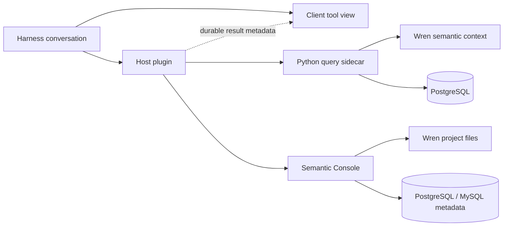

# DSH Data Agent — WrenAI Integration

> Bring governed, semantic-layer-aware data analysis into DeepSeek Harness conversations.

[](LICENSE)


[](https://github.com/Canner/WrenAI)


DSH Data Agent is an out-of-tree DeepSeek Harness bundle built on [WrenAI](https://github.com/Canner/WrenAI). It connects conversational analysis to a governed Wren semantic layer, gives an agent structured semantic context, executes bounded read-only SQL, renders tables and charts inside the conversation, and includes a local visual console for maintaining the semantic project.

> **Project status:** Alpha. The repository is open for evaluation and contribution, but its APIs, configuration, and storage formats may change before the first stable release. The current code is built and installed from source; npm and PyPI publication are intentionally out of scope.

The integration uses only public Harness Bundle, Cordis, tool, presentation-metadata, and Client slot APIs. It does not patch or fork DeepSeek Harness.

This repository depends on the WrenAI Python SDK/Core package `wrenai==0.13.2` and uses its public context, validation, build, field-registry, and project-format APIs. WrenAI is developed by [Canner](https://www.canner.io/). DSH Data Agent is an independent integration; it is not an official WrenAI distribution and is not endorsed by or affiliated with Canner. The product name and interface use the project's own DSH Data Agent branding; “WrenAI” is used only to identify the upstream technology.


## What you get

| Capability | What it provides |
| --- | --- |
| Semantic-aware agent tools | Retrieves Wren context before SQL generation and returns versioned, JSON-safe query results. |
| Governed query execution | PostgreSQL AST validation, object allowlists, read-only execution, row/byte/time limits, and cancellation. |
| Conversation-native results | Reconstructable Chart, Table, and SQL views rendered from durable `tool/result.meta`. |
| Semantic Console | A responsive local UI for data sources, schema import, models, relationships, views, cubes, rules, SQL knowledge, drafts, validation, publishing, and rollback. |
| Bilingual editing | English and Simplified Chinese display metadata without changing Wren's technical identifiers. |
| Verifiable delivery | Unit, package, isolated Harness, real PostgreSQL, replay, and golden-question acceptance gates. |

## Inside DeepSeek Harness

DSH Data Agent renders query results directly in the conversation. The chart view below shows a successful six-row daily-revenue query using the durable result metadata returned by the tool.


The SQL view keeps the generated Semantic SQL inspectable and links it to confirmed SQL knowledge used for the answer.


## How it works



The Host owns two independently supervised Python processes:

- The query sidecar validates semantic context and untrusted SQL, executes bounded PostgreSQL queries, and produces table/chart presentation contracts.
- The Semantic Console serves a local REST API and production SPA for managing Wren projects and datasource profiles.

Datasource credentials stay server-side. They never enter Client payloads, tool output, session metadata, fixtures, or default logs.

## Semantic Console

### PostgreSQL and MySQL data sources

The Console exposes only datasource types that are implemented and available in the running Python environment. The standard install includes PostgreSQL and MySQL drivers for connection testing, schema browsing, and model import.


### Business model workbench

Edit business names, descriptions, visibility, primary keys, and field dictionaries while keeping the generated Wren source and unified diff close at hand.


### Relationship graph

Explore and maintain field-level model relationships in an interactive graph, with source and change views in the same workbench.


The Console also includes:

- Schema, table, and column browsing with explicit model import.
- Revision-protected View and Cube workbenches.
- Business-rule and reviewed SQL-knowledge governance.
- Draft validation, publication, version history, and rollback.
- Source-aware editors for MDL, localized metadata, and generated diffs.

## Quick start from source

### Prerequisites

- DeepSeek Harness `>=0.1.0-rc.10 <0.2.0`
- Node.js `^22.19.0 || >=24`
- pnpm `11.x`
- Python `>=3.11`
- Wren Python CLI/Core `0.13.2`
- PostgreSQL for the agent query path

### Build the workspace

```powershell
pnpm install
pnpm build
```

### Prepare the Python runtime

The following creates a development environment with the Wren/PostgreSQL query runtime and both Console metadata drivers:

```powershell
py -3.11 -m venv .venv
& .\.venv\Scripts\python.exe -m pip install -e ".\python\sidecar[wren]" -e ".\apps\semantic-console[wren]"
```

### Run the Semantic Console

Use the included deterministic sales project for a local tour:

```powershell
$stateDir = Join-Path $env:LOCALAPPDATA "wren-semantic-console\sales-demo"
& .\.venv\Scripts\python.exe -m server `
  --project-dir .\examples\wren-postgres `
  --state-dir $stateDir `
  --static-dir .\apps\semantic-console\web\dist
```

Open [http://127.0.0.1:48763](http://127.0.0.1:48763). The server binds to loopback by default.

## Harness configuration

The workspace builds the bundle package as `@hejielijob/dsh-wren-data-agent`. It is not currently published to npm. Its Host package stages the query sidecar, Semantic Console server, and production SPA into the local package artifact, so the artifact can be installed into Harness after it is built from source.

Configure the Host with an absolute Wren project directory and the Python interpreter that contains the packaged runtime dependencies:

```yaml
- id: wren-data-agent-host
  config:
    pythonExecutable: C:\Python311\python.exe
    projectDir: D:\data\wren-project
    databaseDsnEnv: WREN_DATABASE_URL
    # semanticConsoleEnabled: false
    # workingDirectory: D:\managed\sidecar
```

Provide the read-only PostgreSQL DSN through the operating system or a secret manager, using the environment-variable name configured by `databaseDsnEnv`. Never put the DSN itself in Bundle configuration.

For a packaged Host install, install the Python runtimes into the Host's selected environment:

```powershell
$sidecarDir = "C:\path\to\node_modules\@hejielijob\dsh-wren-data-agent-host\python\sidecar"
$consoleDir = "C:\path\to\node_modules\@hejielijob\dsh-wren-data-agent-host\python\semantic-console"
$python = "C:\Python311\python.exe"

Push-Location $sidecarDir
& $python -m pip install ".[wren]"
Pop-Location
& $python -m pip install $consoleDir
```

The public Harness Client context does not currently expose a stable Host-to-Client Console URL. The Client therefore uses `http://127.0.0.1:48763` by default. An embedding can pass `semanticConsoleUrl` to the exported view/link props or set `localStorage['dsh-wren-data-agent.semantic-console-url']`; only credential-free absolute HTTP(S) URLs are accepted.

## Security model

All model-generated SQL is treated as untrusted input.

- PostgreSQL statements are parsed structurally with `sqlglot`; lexical checks are not used as the security boundary.
- DML, multi-statement SQL, dangerous functions, and unauthorized objects fail closed.
- Query execution uses a read-only account and enforces server-side row, byte, timeout, and cancellation limits.
- Protocol and presentation payloads are JSON-safe and versioned; unknown versions fail closed.
- Sidecar stdout is protocol-only, while diagnostics go to stderr.
- Console credentials are stored outside the Wren project below `~/.wren/semantic-console` and are redacted from API responses.
- The Console is loopback-only and unauthenticated in this MVP. Team authentication, RBAC, approvals, and audit logging remain deployment work.

## Repository layout

| Path | Ownership |
| --- | --- |
| `packages/contract` | Shared Host, Client, and Sidecar contracts. |
| `packages/host` | Harness tools, process supervision, cancellation, and durable result projection. |
| `packages/client` | Conversation Chart/Table/SQL views and Semantic Console entry points. |
| `packages/bundle` | Installable `dsh.bundle` composition. |
| `python/sidecar` | Wren planning, PostgreSQL policy/execution, limits, and chart specifications. |
| `apps/semantic-console` | Local REST server and React management console. |
| `examples/wren-postgres` | Deterministic sales project, seed data, and golden-question corpus. |
| `scripts` | Packaging, acceptance, replay, and evaluation gates. |

## Development and verification

Contributions are welcome. Read [CONTRIBUTING.md](CONTRIBUTING.md) for setup, test, and pull-request expectations. Please report security issues through the private process in [SECURITY.md](SECURITY.md), not through a public issue. User-visible changes are tracked in [CHANGELOG.md](CHANGELOG.md).

Run the standard workspace checks:

```powershell
pnpm typecheck
pnpm test
pnpm build
```

Run the isolated Harness packaging gate:

```powershell
pnpm acceptance
```

It packs the Contract, Host, Client, and Bundle into a fresh temporary Harness profile, verifies the composed configuration, starts the installed runtime, and checks both the Harness web application and plugin assets. It does not modify the Harness checkout.

Run the real PostgreSQL boundary gate after configuring an existing administrator connection:

```powershell
& .\.venv\Scripts\python.exe scripts\acceptance-postgres.py --dry-run
& .\.venv\Scripts\python.exe scripts\acceptance-postgres.py
```

The default provision mode creates and later removes only a uniquely named temporary database and read-only role. For a managed database that must not be changed, use:

```powershell
& .\.venv\Scripts\python.exe scripts\acceptance-postgres.py `
  --mode existing `
  --database-dsn-env WREN_DATABASE_URL
```

Additional evidence gates:

```powershell
pnpm acceptance:replay --dry-run
pnpm evaluate:golden --dry-run
pnpm evaluate:golden --self-test
```

The golden evaluator never calls an LLM or manufactures a quality result. A real AC02 claim requires twenty captured Harness questions, at least 16 first-pass successes, and at least 18 successes after at most one eligible repair.

## Compatibility and current scope

- Compiled and accepted against DSH Desktop runtime `0.1.1-rc.2` while keeping public peer compatibility with Harness `>=0.1.0-rc.10 <0.2.0`.
- Wren Python CLI/Core is pinned to `0.13.2`.
- Agent query execution is currently PostgreSQL-only.
- The Semantic Console supports PostgreSQL and MySQL connection metadata, testing, browsing, and model import.
- Wren Python `0.13.2` does not support View-to-View references; nested View dependencies are rejected before execution.
- Browser hard-refresh rendering remains a separate real-Client acceptance step beyond the API-only replay gate.

## License

This repository is released under the [MIT License](LICENSE), copyright © 2026 `hejielijob-commits`.

Third-party components keep their own licenses:

- The pinned `wrenai==0.13.2` dependency identifies itself as Apache-2.0 and is maintained by the [WrenAI project](https://github.com/Canner/WrenAI).
- The Client bundles Apache ECharts `5.6.0`; its Apache-2.0 `LICENSE` and `NOTICE` are shipped in `packages/client/licenses/echarts`.

The MIT license for this repository does not replace or relicense those third-party components.
